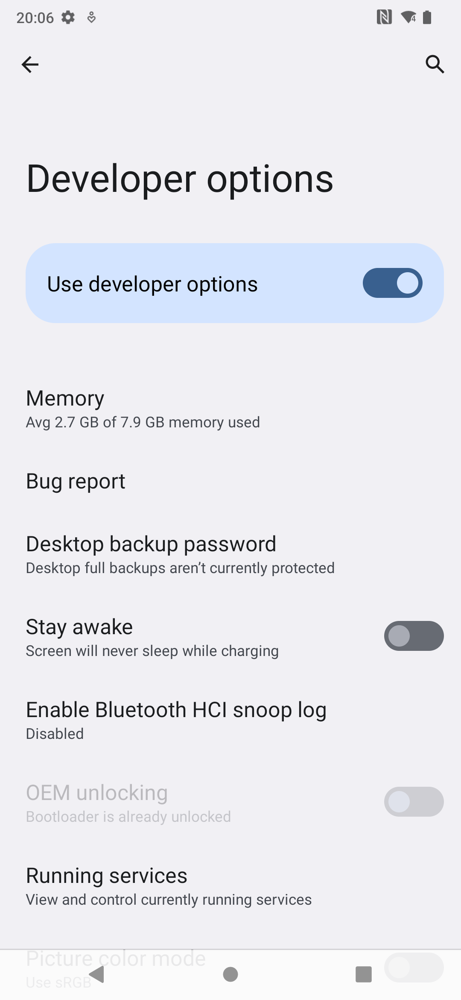
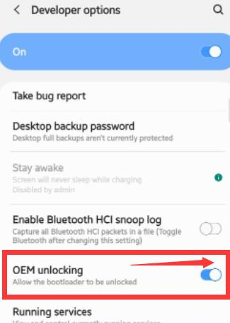
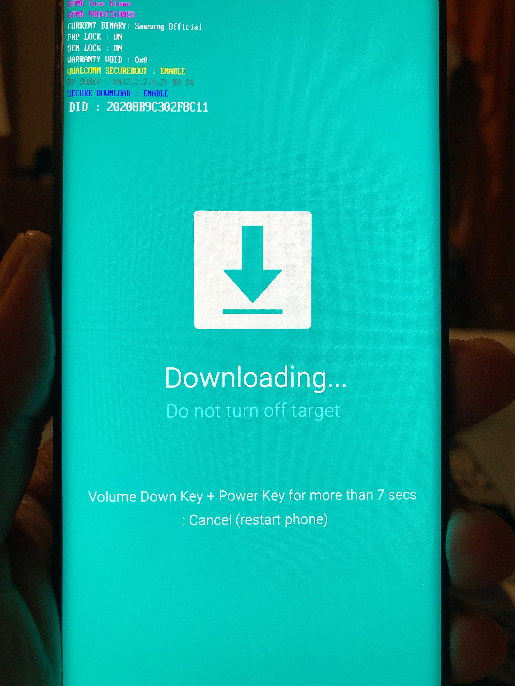
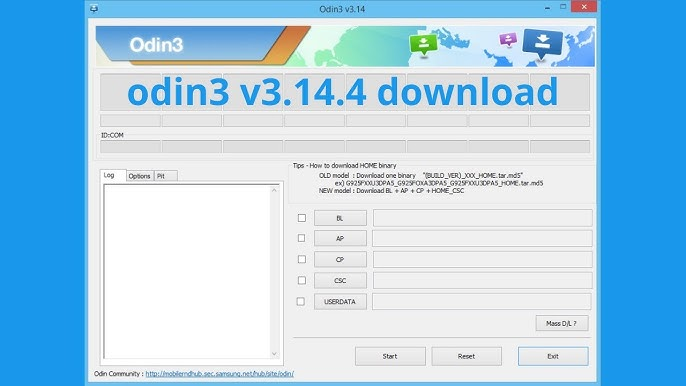
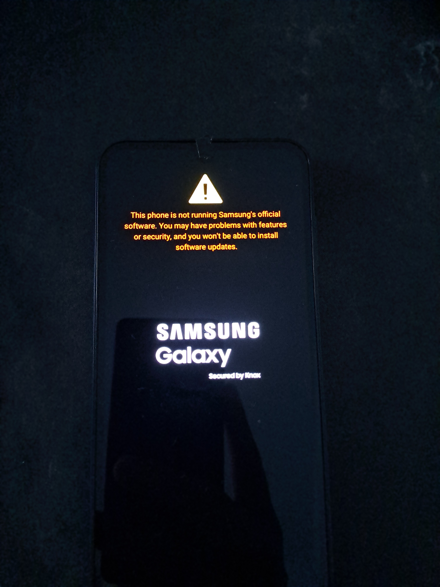

***

# Complete Guide: Rooting Samsung Galaxy F13 with Magisk, Odin, and the Bootloop Recovery Journey

> **A personal experiment documenting the complete process of rooting a Samsung Galaxy F13, including the OEM unlock wait, Magisk patching, Odin flashing, and recovering from a bootloop.**

---

## Table of Contents

- [Introduction: Why I Decided to Root My Galaxy F13](#introduction-why-i-decided-to-root-my-galaxy-f13)
- [Prerequisites and Device Information](#prerequisites-and-device-information)
- [Understanding Samsung's OEM Unlock Restrictions](#understanding-samsungs-oem-unlock-restrictions)
- [The 168-Hour Network Verification Requirement](#the-168-hour-network-verification-requirement)
- [Downloading the Correct Firmware from SamFrew](#downloading-the-correct-firmware-from-samfrew)
- [Extracting and Patching the AP File with Magisk](#extracting-and-patching-the-ap-file-with-magisk)
- [Flashing with Odin: The Process](#flashing-with-odin-the-process)
- [The Bootloop: What Happened and Why](#the-bootloop-what-happened-and-why)
- [Recovering from Bootloop](#recovering-from-bootloop)
- [Android Kernel Concepts](#android-kernel-concepts)
- [Lessons Learned and Best Practices](#lessons-learned-and-best-practices)
- [References and Resources](#references-and-resources)

---

## Introduction: Why I Decided to Root My Galaxy F13

I own a **Samsung Galaxy F13** (model **SM-E135F**), and like many Android enthusiasts, I wanted to unlock its full potential. Root access opens the door to removing pre-installed bloatware, creating complete system backups, experimenting with custom kernels and ROMs, and exploring the Android platform beyond the restrictions imposed by the manufacturer.

What began as a straightforward rooting exercise quickly turned into an in-depth exploration of Samsung's modern security architecture. Recent Samsung devices employ multiple layers of protection—including **VaultKeeper**, **KG (KnoxGuard)**, **RMM**, Android Verified Boot (AVB), and stringent bootloader verification—that make modification significantly more challenging than it was on older devices. Additionally, certain firmware revisions—particularly those incorporating Samsung's stricter configurations, commonly identified by an **"S"** designation in the build number (exactly like the `XXS` in my current baseband)—introduce even tighter controls, further complicating both bootloader modification and successful rooting.

I also encountered Samsung's notorious **168-hour SIM/network requirement** before the OEM Unlock option becomes available, followed by the much more serious issue of a persistent **bootloop** after flashing a patched boot image. What initially seemed like a routine rooting procedure evolved into a reverse-engineering exercise involving the Android boot chain, firmware compatibility, bootloader behavior, and Samsung's layered security mechanisms.

This repository documents that journey in detail. Rather than presenting a simple "how-to-root" guide, it serves as a technical case study of the investigation, the failures, the debugging process, and the lessons learned. By publishing my findings on GitHub, I hope others can understand the challenges posed by Samsung's modern firmware, avoid the same mistakes, contribute additional insights, and build upon this research.

---

## Prerequisites and Device Information

| Specification | Details |
|---------------|---------|
| **Device** | Samsung Galaxy F13 |
| **Model Number** | SM-E135F |
| **Android Version** | 14 |
| **Baseband** | E135FXXSAEYE1 |
| **Build Number** | UP1A.231005.007.E135FXXSAEYE1 |
| **Kernel** | 4.19.198-28701120-abE135FXXSAEYE1 |
| **SoC** | Exynos 850 (Exynos 850 — s5e8535) |
| **SE Status** | Enforcing |

### Software Tools Required

| Tool                    | Version Used | Purpose                              | Source                                                                 |
| ----------------------- | ------------ | ------------------------------------ | ---------------------------------------------------------------------- |
| **Odin**                | 3.14.4       | Flashing firmware to Samsung devices | [Official Odin](https://odindownload.com/)                             |
| **Magisk**              | 26.4         | Patching boot image for root access  | [GitHub - topjohnwu/Magisk](https://github.com/topjohnwu/Magisk)       |
| **SamFrew**             | Web-based    | Downloading Samsung firmware         | [samfrew.com](https://samfrew.com/)                                    |
| **7-Zip**               | 23.01        | Extracting firmware files            | [7-zip.org](https://www.7-zip.org/)                                    |
| **Samsung USB Drivers** | Latest       | Device communication                 | [Samsung Developers](https://developer.samsung.com/android-usb-driver) |

---

## Understanding Samsung's OEM Unlock Restrictions 

### What is OEM Unlocking?

OEM unlocking is the first gateway to modifying your Samsung device's system partition. Without it, you **cannot** flash custom binaries, boot custom recoveries, or root your device.

According to the https://source.android.com/docs/core/architecture/bootloader/locking_unlocking,  the bootloader lock state is stored in a persistent partition and verified during each boot chain stage:

```
Boot ROM → Bootloader (verified) → Kernel (verified) → Userspace
```

### Samsung's Official Restrictions

When I navigated to **Settings → About Phone → Software Information** and tapped "Build Number" seven times to enable Developer Options, I found the **OEM Unlock** toggle. However, this is where Samsung's restrictions kicked in:

1. **Samsung Account Requirement**: The toggle is grayed out unless you're logged into a Samsung account on the device.
2. **Website Step Verification**: Samsung explicitly directs you to its official website to "follow steps"—essentially a deterrent mechanism.
3. **Pre-Owned Device Wait Times (Prenormal KG State)**: While this waiting period isn't required for every device, it was necessary in my case. Because my device was a pre-owned global model stuck in a "prenormal" KG (Knox Guard) state, **it had to remain connected to Wi-Fi and a SIM card for 7 days (168 hours)** before the toggle became available. While some people attempt to bypass this timer by manually tweaking the device's date and time settings, I preferred to simply wait it out over a standard SIM-based connection.
 
 
 
> **Note on Newer Samsung Devices**
>
> This guide applies to Samsung devices that still expose the **OEM Unlock** option. Beginning with **One UI 8 (Android 16)**, Samsung has reportedly removed the bootloader unlocking mechanism[https://sammyguru.com/breaking-samsung-removes-bootloader-unlocking-with-one-ui-8/]() from many Galaxy devices worldwide , including models that were previously unlockable outside North America. Community analysis indicates that this is more than a hidden Developer Option—the bootloader itself no longer contains the code path required to perform an unlock, making conventional rooting and custom ROM installation effectively impossible on updated devices. Users interested in maintaining root access should carefully research their specific model and firmware version before upgrading, as updating to One UI 8 may permanently remove the ability to unlock the bootloader. 
## Why Does Samsung Do This?

Samsung restricts bootloader unlocking for several reasons:

- **Samsung Knox security** — Rooting or unlocking the bootloader permanently trips the **Knox Warranty Bit (0x1)**, disabling certain hardware-backed security features such as Secure Folder and Samsung Pass.
- **Anti-theft protection** — Delaying bootloader unlocking makes it harder for stolen devices to be immediately wiped, modified, and resold.
- **Enterprise and carrier compliance** — Many enterprise deployments and some carrier variants require a locked bootloader to maintain device integrity and satisfy security policies.

Samsung's official documentation confirms that once the **Knox Warranty Bit** changes from **0x0** to **0x1**, it is permanently fused in hardware and cannot be restored.

---

# The 168-Hour Network Verification Requirement

## My Experience

This turned out to be one of the most frustrating parts of the entire rooting process.

To satisfy Samsung's bootloader requirements, I:

1. Inserted an active **Airtel SIM** into the Galaxy F13.
2. Ensured the device maintained a stable mobile network connection.
3. Left the phone powered on for approximately **seven consecutive days (168 hours)**.
4. Avoided rebooting the device during this period as a precaution, since several community reports suggest that certain firmware revisions may restart or invalidate the waiting period.

Although Samsung does not publicly document the exact requirements, maintaining continuous cellular connectivity proved to be the most reliable approach.

---

## Why the Waiting Period Exists

Unlike many Android manufacturers that allow immediate bootloader unlocking, Samsung requires the device to remain connected to a mobile network for an extended period before **OEM Unlock** becomes available.

The precise implementation has never been officially documented. However, reverse engineering efforts and extensive community observations indicate that the bootloader performs a secure eligibility check before exposing the OEM Unlock option.

The waiting period appears to serve multiple purposes:

- Reduce the resale value of stolen devices.
- Prevent immediate bootloader unlocking after a factory reset.
- Ensure the device has been legitimately activated on a carrier network.
- Allow Samsung's security services and **Knox Guard (KG)** to transition the device into an unlock-eligible state.

The exact storage location and verification mechanism remain proprietary. While some community members speculate that state information may be stored in partitions such as **PARAM** or other secure storage, there is no official confirmation from Samsung. What is clear is that the bootloader itself enforces this policy before permitting an unlock.

Community observations also show that the required waiting period varies between firmware versions. Older Samsung devices commonly required **72 hours**, whereas many newer firmware releases—including several Galaxy F-series builds—require approximately **168 hours (7 days)** before the OEM Unlock option becomes available.

> **Note:** Some firmware versions whose build numbers contain the **"S"** designation (security-focused releases) appear to implement stricter Knox Guard and bootloader policies. These builds are generally considered more resistant to modification and rooting, with users reporting longer wait periods, additional verification checks, and increased difficulty in flashing patched images. Samsung has not officially documented these differences, so this conclusion is based on community reports and practical experimentation.

Similarly, while some users report success using only Wi-Fi, the most consistently successful approach is to keep an active SIM installed with a stable cellular network connection throughout the waiting period.

---

## Verification After the Waiting Period

Once the waiting period had elapsed, I rebooted the device and returned to **Developer Options → OEM Unlock**.

The OEM Unlock toggle, which had previously been unavailable, was finally accessible.



Enabling the toggle displayed Samsung's warning:

> *"OEM unlocking will allow the boot loader to be unlocked. This may void the warranty and make the device vulnerable to malware. Unlock anyway?"*

After confirming, the device rebooted into Samsung's bootloader unlock confirmation screen. A second confirmation using the hardware keys permanently unlocked the bootloader, factory-reset the device, and set the **Knox Warranty Bit** to **0x1**, marking the device as modified. From that point onward, the phone was ready for custom recovery and root-related experimentation.

---

## Downloading the Correct Firmware from SamFrew

### Why SamFrew?

Samsung provides firmware through its official portals (like **SamMobile**), but these often require premium accounts for reasonable download speeds. [SamFrew](https://samfrew.com/) is a community-trusted alternative that provides:

- **Free downloads** at reasonable speeds
- **CSC-specific firmware** (important for your region/carrier)
- **Historical firmware versions** (useful for downgrading)

### Identifying My Firmware Version

Before downloading, I checked my current firmware:

```
Settings → About Phone → Software Information
```

My firmware version was: **E135FXXSAEYE1**

The Samsung firmware naming convention follows this pattern:

```
[DEVICE][CSC][PDA]=[VERSION]
   │        │     │
   │        │     └── Build number (PDA)
   │        └──────── Country/Carrier code (CSC)
   └───────────────── Device model
```

For my device:
- **E135F** = Galaxy F13 (single SIM, international)
- **XXS** = Unbranded/multi-CSC with stricter security patches (XX = unlocked, S = Security-focused)
- **AEYE1** = Specific build iteration

### Downloading from SamFrew

1. Navigated to `samfrew.com`
2. Entered model: **SM-E135F**
3. Selected firmware version matching my current build
4. Downloaded the **4-file firmware** (AP, BL, CP, CSC)

The downloaded file was: `SM-E135F_E135FXXSAEYE1_E135FODMAEYE1_E135FXXSAEYE1.tar.md5`

### Understanding the 4-File Structure

Samsung firmware comes in four parts, each flashing a different partition:

| File    | Full Name                       | Purpose                    | Partitions Affected        |
| ------- | ------------------------------- | -------------------------- | -------------------------- |
| **AP**  | Android (PDA)                   | System, kernel, boot image | System, Boot, Vendor, etc. |
| **BL**  | Bootloader                      | Bootloader and related     | Bootloader, PARAM          |
| **CP**  | Core Processor                  | Modem/baseband firmware    | Modem, EFS-related         |
| **CSC** | Consumer Software Customization | Region settings, apps      | CSC, Cache                 |

> **⚠️ Important**: For Magisk rooting, we **only patch and flash the AP file**. Flashing BL or CP incorrectly can permanently brick your device.

### Verifying Firmware Integrity

Always verify the MD5/SHA256 checksum of downloaded firmware. SamFrew typically provides checksums on the download page:

```bash
# Linux/macOS
md5sum SM-E135F_E135FXXSAEYE1_*.tar.md5

# Windows (PowerShell)
Get-FileHash SM-E135F_E135FXXSAEYE1_*.tar.md5 -Algorithm MD5
```

---

## Extracting and Patching the AP File with Magisk

### Step 1: Extracting the AP File

The downloaded firmware is a **tar.md5** archive containing all four files. I extracted only the AP file:

Using **7-Zip**:
1. Right-click the `.tar.md5` file
2. Select **7-Zip → Open Archive**
3. Extract only the file named `AP_E135FXXSAEYE1_[hash].tar.md5`

> **Note**: The `.md5` extension is just a checksum appended by Samsung's packaging tool. The actual content is a **tar archive**.

### Step 2: Transferring AP to the Device

I transferred the extracted AP file to my Galaxy F13's internal storage:

```
/sdcard/Download/AP_E135FXXSAEYE1.tar.md5
```

### Step 3: Patching with Magisk

[Magisk](https://github.com/topjohnwu/Magisk) works by **patching the boot image** within the AP file to inject the `su` binary and Magisk daemon.

**How Magisk Patching Works (Technical):**

Magisk modifies the boot image by:
1. **Extracting the ramdisk** from the boot image
2. **Injecting `magiskinit`** as the init process (`/init`)
3. **Adding Magisk binaries** to the ramdisk
4. **Patching the kernel's cmdline** if needed for `skip_initramfs` devices
5. **Repacking** the boot image with the same headers and signatures (where possible)

Reference: [Magisk Technical Details](https://topjohnwu.github.io/Magisk/technologies.html)

**My Patching Process:**

1. Installed **Magisk 26.4** APK on the Galaxy F13
2. Opened Magisk → **Install** → **Select and Patch a File**
3. Navigated to the AP file: `/sdcard/Download/AP_E135FXXSAEYE1.tar.md5`
4. Tapped **Let's Go**
5. Waited for patching to complete (~30-60 seconds)

```
Magisk output:
- Unpacking tar archive
- Found boot image at: boot.img
- Patching boot image
- Repacking to tar archive
- Output: /sdcard/Download/magisk_patched_[random].tar
```

6. The patched file was saved as: `/sdcard/Download/magisk_patched_250113_xxxx.tar`

> **⚠️ Critical Note**: Notice the output is `.tar`, not `.tar.md5`. This is normal—Magisk strips the MD5 checksum. Odin can still flash `.tar` files.

### Step 4: Transferring Patched File to PC

I connected the Galaxy F13 to my PC via USB and copied the patched file to my working directory:

```
C:\Firmware\magisk_patched_250113_xxxx.tar
```


---

## Flashing with Odin: The Process

### What is Odin?

[Odin](https://odindownload.com/) is Samsung's internal flashing tool that leaked to the public. It communicates with Samsung devices in **Download Mode** via the Samsung USB protocol. Odin flashes firmware to specific partitions using a low-level protocol that bypasses Android's normal update mechanism.

### Entering Download Mode

1. **Power off** the Galaxy F13 completely
2. Hold **Volume Up + Volume Down** simultaneously
3. Connect the USB cable while holding both buttons
4. Release buttons when the **Download Mode** screen appears

> **Screenshot Placeholder: Download Mode**
> ```
> 
> Alt text: Samsung Galaxy F13 in Download Mode screen
> ```

The Download Mode screen should show:
- Model: **SM-E135F**
- Binary: **E135FXXSAEYE1**
- Status: **Custom** (if bootloader is unlocked)
- A blue/green warning screen with "Downloading... Do not turn off target!!"

### Configuring Odin

> **Screenshot Placeholder: Odin Interface**
> ```
> 
> Alt text: Odin flashing tool 
> ```

I configured Odin as follows:

| Setting                     | Value                            | Reason                                 |
| --------------------------- | -------------------------------- | -------------------------------------- |
| **AP**                      | `magisk_patched_250113_xxxx.tar` | Patched boot image                     |
| **BL**                      | *Left empty*                     | Not modifying bootloader               |
| **CP**                      | *Left empty*                     | Not modifying modem                    |
| **CSC**                     | *Left empty*                     | Not modifying region settings          |
| **Options → Auto Reboot**   | ✅ Checked                        | Auto-reboot after flash                |
| **Options → F. Reset Time** | ✅ Checked                        | Reset flash timer                      |
| **Options → Repartition**   | ❌ **UNCHECKED**                  | Critical—never check for AP-only flash |

### The Flash Process

1. Clicked **Start** in Odin
2. Odin showed progress in the log window:

```
<File analysis> 
AP:[magisk_patched_250113_xxxx.tar]
Blocks:625, Writing:625, Skip:0
File analysis finished.
<OSM> All threads completed. (su 0x40)
NAND Write Start!
```

3. The progress bar moved to ~100%
4. In the top-left box of Odin, it showed: **"PASS"** in green
5. Device automatically rebooted

> **Screenshot Placeholder: Odin PASS**
> ```
>
> Alt text: Odin tool showing successful PASS after flashing Galaxy F13
> ```

At this point, I thought everything was fine. I was wrong.

---

## The Bootloop: What Happened and Why

### What is a Bootloop?

A **bootloop** occurs when an Android device fails to complete the boot sequence and continuously restarts. The device shows the manufacturer logo (or boot animation) and then restarts, never reaching the lock screen.

### My Bootloop Experience

After Odin showed "PASS" and the device rebooted, here's what happened:

1. **Samsung Galaxy logo** appeared → normal so far
2. Logo stayed on screen for ~5 seconds
3. Screen went black
4. **Samsung Galaxy logo appeared again**
5. This cycle **repeated indefinitely**

> **Screenshot Placeholder: Bootloop**
> ```
> 
> Alt text: Samsung Galaxy F13 bootloop stuck on Samsung logo
> ```


To actually interrupt the endless bootloop and regain control of the device, I had to change my approach in Odin. During my initial root flash, the **Auto Reboot** option was checked, which instantly kicked the phone back into the bootloop the moment Odin displayed "PASS". To break this cycle, I flashed the stock AP file with **Auto Reboot explicitly unchecked**, which left the phone powered off and gave me the crucial window needed to manually enter Download Mode. However, I quickly discovered that simply holding the hardware buttons on a powered-off device did nothing; Download Mode strictly refused to trigger unless the USB cable was physically plugged in while the volume buttons were held down, making the cable connection a mandatory hardware trigger rather than just a data link.
### Diagnosing the Bootloop Cause

After research and analysis, here are the **most likely causes** of my bootloop:

#### 1. **Strict SE Status (SELinux) Enforcement**

As noted in my device specs, the **SE Status is enforcing**. Security-Enhanced Linux (SELinux) operates in two main modes: *Permissive* (logs violations but allows them) and *Enforcing* (blocks violations). On Android 14 with kernel `4.19.198-28701120-abE135FXXSAEYE1`, the policies are incredibly strict. If the Magisk-patched ramdisk fails to properly transition SELinux contexts or if the init process triggers an enforcing policy violation early in the boot sequence, the kernel will immediately panic and reboot the device.

#### 2. **Boot Image Signature Verification Failure**

Even with OEM unlock enabled, Samsung devices with newer firmware versions may still verify the boot image signature at the **TrustZone** level. The [Android Verified Boot (AVB)](https://source.android.com/docs/security/verifiedboot) specification describes this chain:

```
Verified Boot State:
  - GREEN:   Device is locked + boot image verified → Boot normally
  - ORANGE:  Device is unlocked + boot image unverified → Boot with warning
  - YELLOW:  Device is locked + boot image verification failed → Boot prevented
  - RED:     Device is locked + boot image is corrupt → Boot prevented
```

On my Galaxy F13, the bootloader may have been reporting **ORANGE** state, but TrustZone or Samsung's RKP (Real-time Kernel Protection) could still be rejecting the modified boot image.

#### 3. **dm-verity and vbmeta Issues**

Samsung uses **dm-verity** (device-mapper verity) for transparent integrity checking of system partitions. Magisk typically patches `vbmeta` to disable dm-verity, but with a **4-file firmware flash where only AP is replaced**, the original `vbmeta` flags may conflict with the patched boot image.

Reference: [dm-verity documentation](https://www.kernel.org/doc/html/latest/admin-guide/device-mapper/verity.html)

#### 4. **Exynos 850 Specific Boot Chain**

The Exynos 850 processor has a specific boot chain:

```
iROM (Internal ROM) → iBL1 (First Stage Bootloader) → iBL2 (Second Stage) 
→ BL31 (ARM Trusted Firmware) → BL33 (U-Boot) → Kernel → Android
```

If any stage in this chain rejects the modified boot image—especially considering the newer `4.19.198` kernel handling—the device reboots. The [ARM Trusted Firmware documentation](https://trustedfirmware-a.readthedocs.io/) describes how BL31 enforces security policies.

#### 5. **Firmware Version Mismatch**

I may have had a **mismatch** between:
- The firmware I downloaded (based on what SamFrew listed)
- The actual firmware running on my device
- The baseband/modem version expectations

Even minor version mismatches between AP and the existing BL/CP can cause bootloops.

### Getting Device Logs

To diagnose further, I would need to access **last_kmsg** or **pstore** logs:

```
# In Download Mode, some Samsung devices expose logs via:
adb shell cat /proc/last_kmsg
# or
adb shell cat /sys/fs/pstore/console-ramoops-0
```

Unfortunately, in a bootloop, ADB isn't accessible unless you can interrupt the boot sequence.

---

## Recovering from Bootloop

### Method 1: Flashing Stock AP via Odin (Recommended)

The safest recovery method is to flash the **original, unpatched AP file** back:

1. Enter **Download Mode** (Volume Up + Volume Down + USB cable)
2. Open Odin
3. Load the **original AP file** (unpatched) into the AP slot
4. Ensure **Repartition is UNCHECKED**
5. Click **Start**
6. Device should boot normally

### Method 2: Full 4-File Firmware Flash

If Method 1 doesn't work, a complete firmware flash may be necessary:

1. Extract all four files (AP, BL, CP, CSC) from the original firmware
2. Load each into its respective Odin slot
3. **Check Repartition** only if downgrading (WARNING: wipes data)
4. Flash

> **⚠️ WARNING**: Full flash with Repartition will **wipe all user data**. This is a last resort.

### Method 3: Using Emergency Download Mode (EDL)

If the device won't even enter Download Mode, Samsung devices with Qualcomm SoCs can use **Emergency Download Mode (EDL/9008)**. However, the **Exynos 850 doesn't support EDL**, making this option unavailable for the Galaxy F13.

### My Recovery

I recovered by **flashing the original unpatched AP file** through Odin. The device booted successfully after this, confirming that the bootloop was caused by the Magisk-patched boot image, not by any hardware issue or incorrect flashing procedure.


## Lessons Learned and Best Practices

### What I Would Do Differently

1. **Check XDA Forums First**: I should have searched [XDA Developers](https://forum.xda-developers.com/) for Galaxy F13-specific rooting guides before attempting.
2. **Verify Firmware Exact Match**: Use `*#1234#` in the phone dialer to get exact PDA/CSC/Phone versions and match them precisely.
3. **Keep a Backup of Stock AP**: Always keep the original unpatched AP file readily accessible for recovery.

### General Best Practices for Samsung Rooting

| Practice | Reason |
|----------|--------|
| Always unlock bootloader **before** any flashing | Required for custom binaries |
| Never check **Repartition** for AP-only flashes | Will corrupt partition table |
| Keep device **above 50% battery** during flashing | Prevents bricking from power loss |
| Use **original Samsung USB cable** | Cheap cables cause connection drops |
| **Verify MD5** of all downloaded files | Corrupt files = instant brick |
| **Read XDA** for device-specific issues | Every Samsung model has quirks |
| Don't interrupt Odin **mid-flash** | Will brick the device |

---

## References and Resources

### Official Documentation

| Resource                       | URL                                                                          |
| ------------------------------ | ---------------------------------------------------------------------------- |
| Android Verified Boot          | https://source.android.com/docs/security/verifiedboot                        |
| ARM Trusted Firmware           | https://trustedfirmware-a.readthedocs.io/                                    |
| dm-verity Kernel Documentation | https://www.kernel.org/doc/html/latest/admin-guide/device-mapper/verity.html |
| Samsung Knox Official          | https://www.samsungknox.com/en                                               |
| Samsung USB Drivers            | https://developer.samsung.com/android-usb-driver                             |

### Open Source Projects

| Project                                 | URL                                         | License    |
| --------------------------------------- | ------------------------------------------- | ---------- |
| Magisk                                  | https://github.com/topjohnwu/Magisk         | GPL-3.0    |
| Android Open Source Project             | https://android.googlesource.com/           | Apache-2.0 |
| Linux Kernel                            | https://github.com/torvalds/linux           | GPL-2.0    |
| Heimdall (Open Source Odin Alternative) | https://github.com/Benjamin-Dobell/Heimdall | MIT        |

### Community Resources

| Resource                             | URL                                                       |
| ------------------------------------ | --------------------------------------------------------- |
| XDA Developers Forum                 | https://forum.xda-developers.com/                         |
| SamFrew Firmware                     | https://samfrew.com/                                      |
| Magisk Documentation                 | https://topjohnwu.github.io/Magisk/                       |
|                                      |                                                           |

---

## Disclaimer

> **⚠️ Legal and Safety Disclaimer**
>
> - Rooting your device **voids your Samsung warranty** permanently (Knox flag cannot be reset)
> - Rooting may **violate your carrier's terms of service**
> - Incorrect flashing can **permanently brick** your device
> - Rooted devices may **fail safety checks** (Samsung Pay, banking apps, Play Integrity)
> - This guide is provided **as-is** for educational purposes only
> - I am **not responsible** for any damage to your device

---

## Contributing

If you have successfully rooted a Galaxy F13 or have insights into why the bootloop occurred, please:

1. **Open an Issue** with your findings
2. **Submit a Pull Request** with corrections or additions
3. **Share your firmware version** and Magisk version that worked

---

*Last Updated: 2026-09-07*
*Device: Samsung Galaxy F13 (SM-E135F)*
*Status: Bootloop encountered — recovery successful*# horselina.github.io
Experiments on android kernel security, Mistakes and Learnings
